# Mad-Game-Center
+ 두 가지 게임을 즐길 수 있는 웹을 구현했다. 
+ 첫 번째 게임은 혼자서 즐길 수 있는 탁구 게임을 Threejs로 구현했고,
+ 두 번째 게임은 최대 6명이서 즐길 수 있는 게임을 구현했다.

> 개발자: 김찬영, 김태우, 최종윤
>
> Skill : React.js, three.js / Node.js, MongoDB, socket.io

---

## 기능 소개

### Login

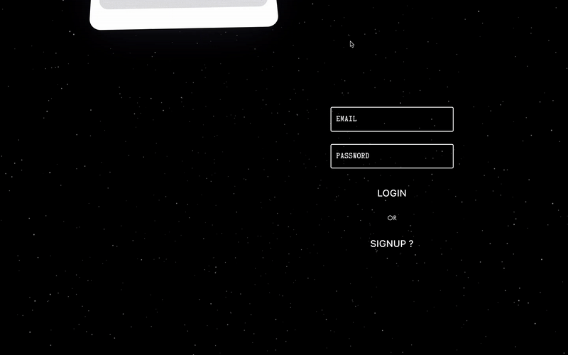

+ 로그인과 회원가입을 할 수 있다.
+ 카드가 쌓이는 애니메이션은 react-spring을 이용하였다.

### Main

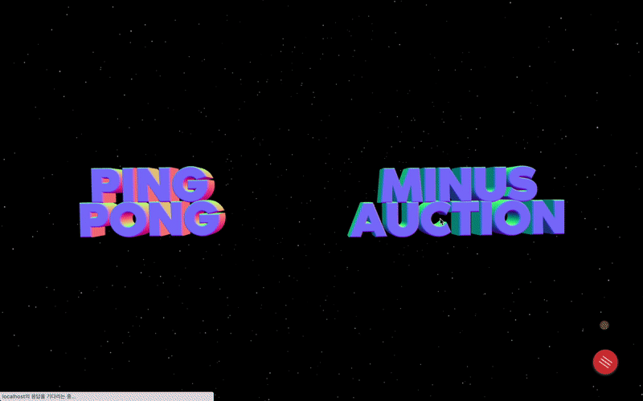 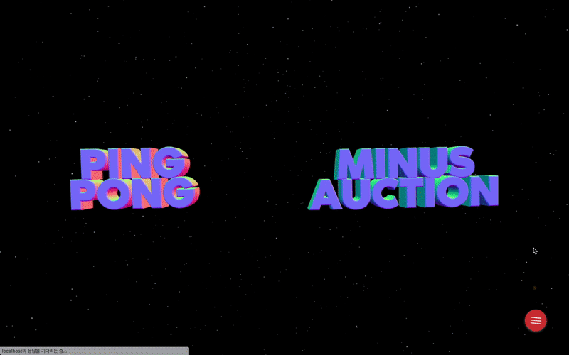

+ 탁구와 마이너스 경매 두 개의 게임 중 하나를 선택할 수 있다.
+ 글자를 클릭하면 해당 게임 페이지로 넘어간다.
+ 우측 하단의 플로팅 버튼으로 로그아웃이 가능하다.
+ react-three-fiber을 이용해 배경과 글시를 3d로 구현했다.
+ 마우스를 글씨 위에 올리게 되면 확대되는 기능을 추가헀다.
+ OrbitControls 기능을 넣어 마우스로 줌 인/아웃을 하면 글씨가 작아지고 360도 회전도 가능하도록 구현했다.
+ 모든 페이지에 공통적으로 들어가있는 배경은 react-three-fiber에 있는 Star를 이용해 만들었다.

### Game 1 : Ping-Pong

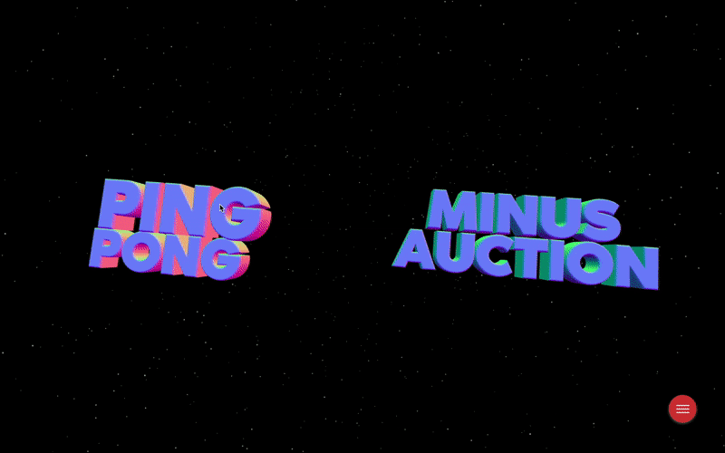 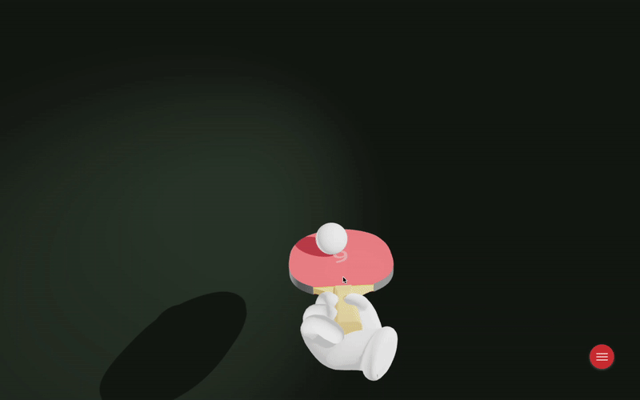

+ 혼자 즐길 수 있는 탁구 게임을 구현했다.
+ 공이 탁구채에 닿을 때마다 숫자가 하나씩 증가하고, 바닥에 떨어지거나 너무 높게 날아가면 0부터 다시 시작된다.
+ 탁구채는 glb 파일을 로드해서 이용했다.
+ 우측 하단의 플로팅 버튼에서 메인 화면으로 돌아갈 수 있다.
+ react-three-fiber를 사용했다.

### Game 2 : Minus Auction

#### Lobby

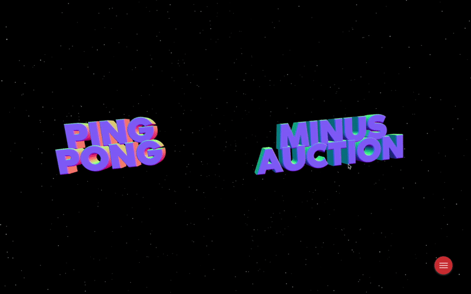 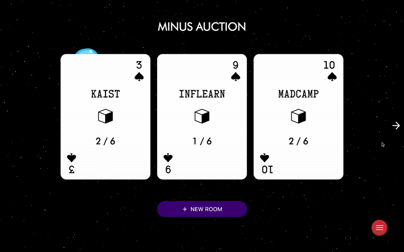

+ 메인 화면에서 Minus Auction을 클릭하면 로비 화면이 뜨게 된다.
+ 현재 개설되어있는 게임 방을 확인할 수 있다.
+ 카드 중앙 위에는 호스트 이름, 중앙 아래에는 현재 방 인원이 표시된다.
+ 방이 여러 개일 경우는 좌우의 화살표 버튼을 이용해 넘겨서 볼 수 있다.
+ 방을 선택하면 카드가 뒤집히는 효과를 주었고, react-spring을 이용했다.
+ 우측 하단의 플로팅 버튼으로 새로고침, 로그아웃, 메인으로 돌아가기를 할 수 있다.
+ 새로고침을 누르면, 실시간으로 방을 계속 확인할 수 있다.
+ New Room 버튼을 누르면 방을 생성할 수 있다.
+ 뒤에 배경은 마찬가지로 react-three-fiber을 이용해 Star로 구현했고, 움직이는 우주선은 css를 이용했다.

#### Game Playing

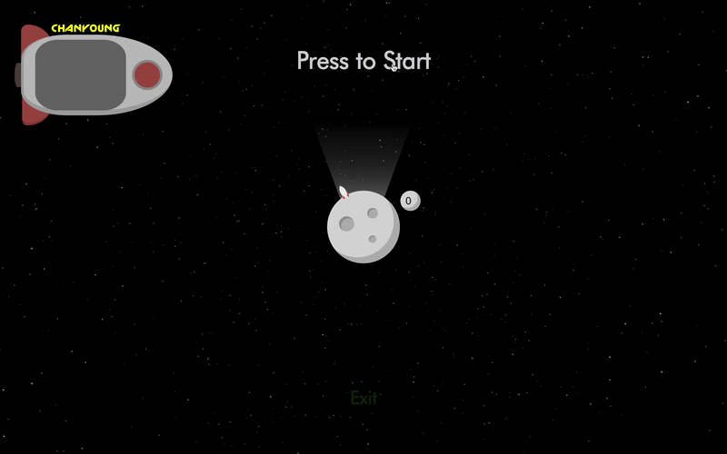 

+ 혼자일 경우 게임을 시작할 수 없다.
+ 두 명 이상 접속했을 때 방장이 Press to Start 버튼을 누르면 게임이 시작된다.

> 게임 설명
>  
> 1. -3부터 -35까지의 경매 상품이 있으며, 한 개의 히든 상품은 끝까지 경매에 오르지 않는다.
> 
> 2. 자기 차례에 입찰 상품을 클릭하면 낙찰할 수 있다.
> 
> 3. 상품을 낙찰하고 싶지 않다면 칩을 지불하고 턴을 넘길 수 있다.
> 
> 4. 마지막에 가지고 있는 칩 수와 상품들의 총 합이 자신의 점수가 되며, 점수의 절댓값이 가장 작은 사람이 승리한다. 
> (단, 연속된 숫자를 보유하고 있는 경우엔 절댓값이 낮은 숫자만 점수에 포함된다.)

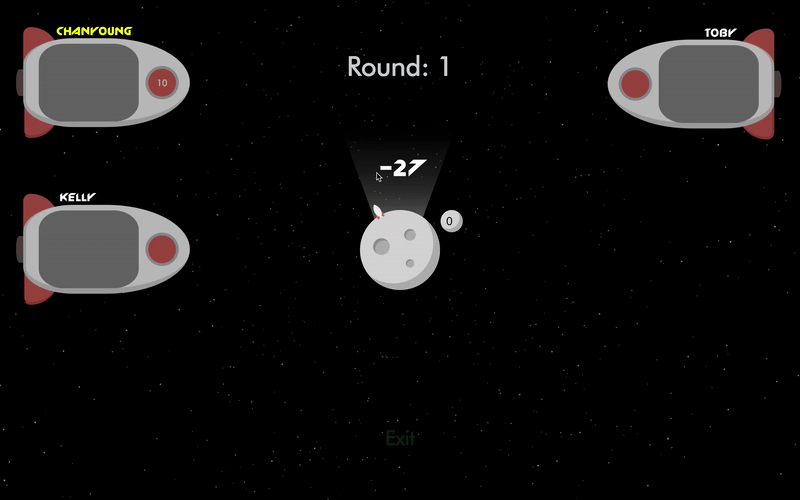 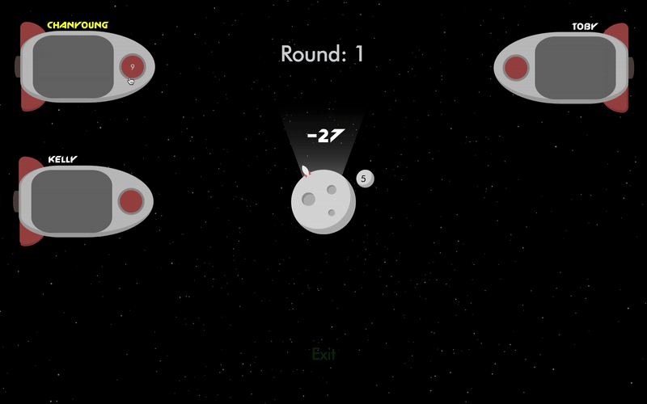

+ 자신의 이름은 노란색으로 표시된다.
+ 흔들리는 우주선으로 현재 턴을 확인할 수 있다.
+ 우주선의 빨간 창문을 클릭하면 칩을 지불하고 턴을 넘길 수 있다.
+ 달 위의 숫자를 클릭하면 상품을 낙찰할 수 있다. 
+ 달 옆의 작은 원에는 쌓인 칩이 표시되고, 낙찰 받을 경우 쌓인 칩을 상품과 함께 가져온다.

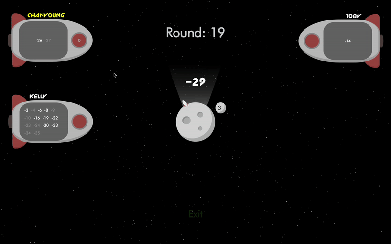 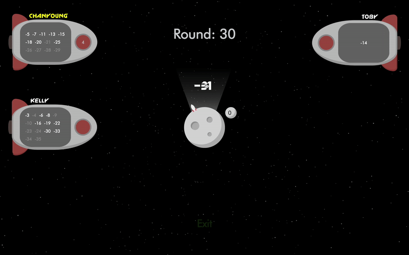

+ 가지고 있는 칩이 0개라면 턴을 넘길 수 없어 강제로 낙찰을 해야만 한다.
+ 32개의 상품이 모두 낙찰되었다면 게임이 종료된다.
+ 점수가 가장 높은 사람이 승리하고, 순위가 표시된다.

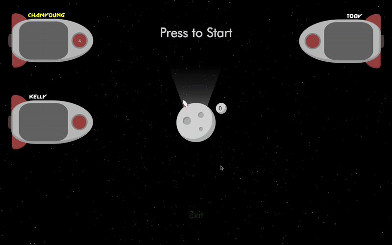 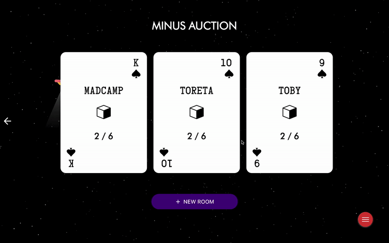

+ 방장이 방을 나갔을 경우, 두 번째에 있던 사람이 방장이 되는 것을 확인할 수 있다.
+ 로비에서 메인 화면으로 나갈 수 있다.

---

## Implementation

### DB

> 사용한 Schema는 User와 Gameroom으로 두 개이다. 
> User Schema는 회원 별로 고유한 정보들을 담고 있고, 정보를 표시하거나 유저를 구별할 때 사용되었다.
> Gameroom Schema는 게임을 플레이하는 각각의 방의 정보를 담고 있고, 게임의 진행을 관리하는 역할을 한다.

#### User Schema
+ 구성: name, email, password, lastname, role, token, nowSocket 등
+ 회원가입
  - email은 고유한 값이므로, email로 중복여부를 체크한 후에 비밀번호를 hash하고 salt화를 한다(bcrypt). 그리고 유저 정보를 DB에 저장한다.
+ 로그인
  - email과 password를 통해 hash된 비밀번호를 비교해서 확인한다.
  - 정보가 맞다면 JWT를 생성해서 쿠키에 저장한다.
+ 로그아웃
  - 유저정보를 DB에서 찾아 해당 유저의 JWT를 삭제한다.

#### Gameroom Schema
+ 구성: roomTitle, players 등
+ roomTitle
  - 유저들이 방에 접속할 수 있는 로비 화면에서 방 제목을 표시할 때 필요한 정보이다.
+ players
  - 현재 방에 접속하고 있는 유저들의 User ID의 배열이다.
  - 게임 방 내에서 유저들을 표시해주는 역할을 한다.

### Game Playing

> 게임이 진행될 때는 방에 존재하는 모든 유저들에게 실시간으로 변화 정보를 제공해야하므로 Socket.IO API를 활용했다.

+ 새로운 유저가 방을 만들면 DB에 새로운 Gameroom 데이타가 생성된다.
+ 항상 Gameroom Schema의 players 배열의 첫번째 User가 방장이 되고, 방장만이 Play Start를 누를 수 있다.
+ 새로운 유저가 방에 들어오거나 방을 나가게 된다면, Socket을 통해 실시간으로 Gameroom 데이타의 players 배열이 갱신된다. 그리고 그 정보가 socket room의 모두에게 전달된다.
+ 게임을 진행할 때 게임 시작, 턴 넘김, 낙찰, 게임 종료 등의 변화가 일어날 때마다 Socket으로 Socket room에 속하는 모든 유저들에게 변화를 알리고, 변화한 데이타를 전달해서 방의 모든 유저가 실시간으로 변화가 갱신되도록 구현했다.
+ 게임 나가기를 통해 방을 나가는 것과, 창을 닫았을 때, 그리고 게임이 튕겼을 때 등의 모든 Socket disconnect 상황에 대해 남아있는 유저들에게 변화를 알릴 수 있도록 처리했다.

## Contacts
Contributors
- 김찬영, itnoj15@kaist.ac.kr
- 김태우, rlaxodntttt@kaist.ac.kr
- 최종윤, joyo10@kaist.ac.kr

